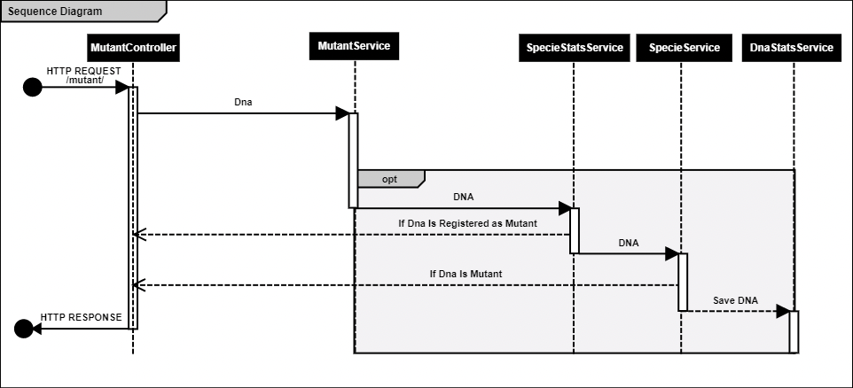

# 👽 MUTANT VALIDATOR

[](https://codecov.io/gh/4b4k3r/bwl-mutant-test)

Este servicio tiene como objetivo analizar secuencias de ADN en busqueda de la segregacion de mutantes y no mutantes.

### Flujo de procesamiento

El componente al recibir una peticion Http mediante el path /v1/mutant envia el DNA recibido
al servicio de estadisticas de especie (SpecieStatsService) para validar que el DNA no exista 
en los registros de base de datos, si existe, su registro contiene la evaluacion para conocer
si su adn corresponde a un mutante o no, si no existe en base de datos se evalua en el
servicio de especies si es que el DNA corresponde a un mutante o no y se devuelve la respuesta,
de forma paralela se persiste el DNA base de datos haciendo uso del servicio de estadisticas de DNA
(DnaStatsService) y se incrementa el numero de casos mutantes o no encontrados 
y se recalcula el radio de mutantes sobre los no mutantes.



>**Nota**: Las estadisticas de DNA se incrementaran ya sea que exista registro del DNA o no en base de datos

### 📝 Requerimientos de Ejecucion 

- Java 8
- Redis 6.X
  d71be29b-cff4-4c0a-9ad5-663d331a08fd
### 🔨 Compilacion

- Java 8
- Redis 6.X
- Maven 3.6.X

Ejecutar el siguiente comando en el directorio raiz del proyecto

```mvn clean package```

A continuacion se generara la carpeta `target` en el directorio raiz del proyecto, dentro se encontrara 
el archivo con nombre `genetic-analysis-x.x.x.x.jar` el cual sera nuestro ejecutable con sus dependencias embedidas

### ⚙ Configuracion de Ambiente

El componente requiere de las siguiente VM Option al momento de ejecutar el componente:

|VM Option               | Valor                         | Descripcion                             |
|------------------------|-------------------------------|-----------------------------------------|
|`spring.config.location`|./config/application.properties|Ruta del archivo de propiedades de spring|

Se recomienda el uso de un script (`ShellScript`) para indicar el comando a ejecutar para iniciar la ejecucion
como un servicio, su estructura recomendada es la siguiente :

```Shell Script
java -Dspring.config.location=./config/application.properties -jar mutant-validator-0.0.1.jar > log/terminal.log &
```

En donde :

|Elemento|Descripcion|
|---|---|
|`java`|Binario de Java|
|`-D`|Bandera para agregar una deficion a la maquina virtual de java (VM Option)|
|`-jar`| Se indica que el siguiente elemento corresponde a la definicion del archivo .jar a ejecutar|
|`>`|Se indica que el siguiente elemento corresponde a la definicion del archivo en el cual se depositaran los logs que arroje el componente|
|`&`|Se indica qu el proceso se ejecutara en modo demonio (El proceso generado no dependera del proceso que lo inicio)|

### Propiedades

El archivo `application.properties` hace uso de las siguientes propiedades:

- spring.redis.host : Host del servicio de redis
- spring.redis.port : Puerto del servicio de redis
- spring.redis.database : Base de datos a utilizar (por defecto es 0 y es opcional)
- spring.redis.username : Nombre de usuario para autenticar (opcional)
- spring.redis.password : Contraseña asociada al usuario a autenticar (opcional)

### 🚀 Despliegue

Si no se cuenta con un entorno de ejecucion, se puede realizar el despliegue automatico del componente al app engine de google por lo que 
solamente sera necesario ejecutar el siguiente comando en el directorio raiz del proyecto: 

`gcloud app deploy`

[Es posible acceder a la vista de swagger del servicio](todo)

### 📄 Documentation

[JavaDocs documentation is avaliable](todo)

### 📍 Endpoint

- `/v1/mutant/`
  - Nos permite evaluar si el ADN de una especie es mutante o no
    - Entrada : El componente hace uso de un objeto como se muestra a continuacion
      - ```json
        {
          "dna": [
                    "ATGCGA",
                    "CAGTGC",
                    "TTATGT",
                    "AGAAGG",
                    "CCCCTA",
                    "TCACTG"
          ]
        }
        ```
      - Salida: El componente nos puede responder de acuerdo a los siguientes posibles eventos:
        - 403 (Forbbiden) : El ADN no corresponde a un mutante o no tiene la estructura adecuada
        - 200 (OK) : El ADN corresponde al de un mutante
- `/v1/stats` 
  - Nos permite conocer las estadisticas de nuestro servicio de evaluacion
    - La respuesta contiene el siguiente formato:
      - ```json
            {
              "ratio": 0.0,
              "count_mutations": 0,
              "count_no_mutation": 0
            }
        ```
        - count_no_mutation : Contador de ADN no mutante solicitado a evaluar 
        - count_mutations : Contador de ADN Mutante solicitado a evaluar
        - Ratio : Promedio de Mutantes y no mutantes (count_mutations / count_no_mutation)

# 🧪 Test

Para ejecutar las pruebas unitarias y el analisis de cobertura en cojunto sera necesario ejecutar el siguiente comando en
la ruta raiz del directorio del proyecto : 

`mvn test` 

> **NOTA**: La documentacion de la cobertura se almacena en el directorio `target/site/jacoco/` en la ruta raiz del proyecto

### 🎉 Changelog
- 1.0.0.0
  - Version base con :
    - Web service rest (revisar el apartado `Endpoint`)
    - Interfaz web documentada con Swagger
    - Integracion a base de datos
    - Integracion al servicio de despliegue
    - La documentacion de proyecto
    
### 🏋️‍♂️To Do
  - Nice To Have (Logeo de Eventos HTTP y del sistema de forma individual)